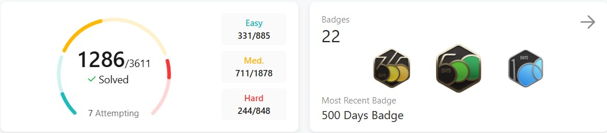
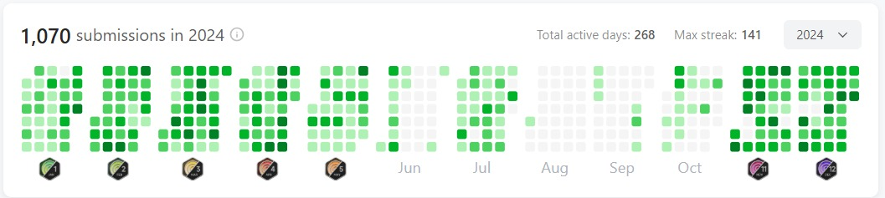

<h1 align="center">Hi 👋 I'm Amarjeet Kumar Shah (React.js Intern at Celebal Technology)</h1>

<h3 align="center">MERN STACK DEVELOPER 💯</h3>

---

React.js Intern @Celebal Tech || Ex- Software Intern @( Motion Cut | Devtern | Main Flow | Edge Flex Technology ) || 50daysofcode on @LeetCode|| Btech'26 || 3.5⭐ LEETCODE || 👑 Top 5% 🌍 LEETCODE || 🚀 Building @DSAwithAmarjeetKumarShah || Problem Solving Enthusiast 🧠 || 1200DaysOfCode Streak 🔥 on @LeetCode || ⭐ Problem Solving || 1300+ Problems Solved on DSA

---

  
  
  
    
  

---

## 🧃 About Me

- 🛠️ I’m currently working on Celebal Technology as an React.js Intern).

- 🧠 **Hardcore DSA Enthusiast & Problem-Solving Addict**  
  Solved **1200+ problems** with **1000+ Days of Consistent Code** across all major platforms.  
  Passionate About Crafting Efficient Code.

- 👩‍💻 **Tech Explorer** – Love to learn new technologies and explore new sets of areas.

- 🖐️ **Hand-Holding Expertise**: MERN STACK
  
- 🤔 I’m looking for help with Data Structures and Algorithms 😭

- 😄 Pronouns: He/His
- ⚡ Fun fact: My portfolio is [Amarjeet Kumar Shah](https://amarjeet-kumar-shah.github.io/Portfolio/)
  
- 📫 Reach me at: [Email](mailto:amarjeetkumarshah.it26@gmail.com), [Linkedin](https://www.linkedin.com/in/amarjeetkumarshah/)

---

## 💼 Professional Experience :-

### **Celebal Technologies**

**July 2024 – Present**  
SDE - 1 · Delhi, India · Remote

- 🚀 **Built and scaled the flagship "Roadmaps" feature**, delivering **100+ curated learning paths** across DSA, Development, and System Design — **used by 100K+ users**. Improved personalization and relevance, while reducing API response time from **2.1s to < 300ms**, resulting in a **7x faster experience** and **40% higher user engagement**.

- 🎥 **Developed and integrated the "AskAI + Discussion Forum"**, an intelligent peer-programming assistant where users can **interact with AI** to solve DSA/Dev doubts and collaborate with others — enabling **on-demand doubt resolution** and **community learning**.

- 📹 **Engineered a Session Recording Bot** using **Python, Selenium**, and **headless Azure VMs** with deep link automation — automating session joining and recording, cutting down **100% of manual effort** and improving reliability.

- ⚙️ **Optimized 150+ APIs** by implementing **advanced caching layers, async processing, and API pipelines**, reducing backend latency by **up to 70%** and improving system throughput.

- 📉 **Reduced core web vitals TBT, LCP, and FCP from 4.4s to 990ms** through advanced frontend optimizations (SSR, dynamic imports, lazy-loading APIs), significantly boosting **UX for 15K+ monthly active users**.

- 🛠️ **Led the end-to-end performance overhaul** of the platform, focusing on smoother tab-switching experiences, minimal downtime, and blazing-fast navigation across the app.

